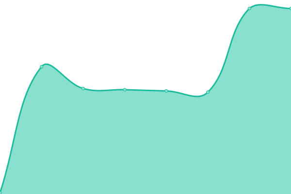
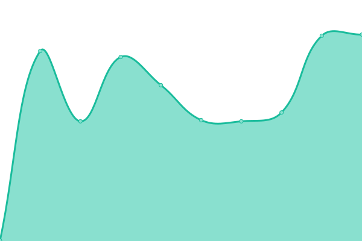
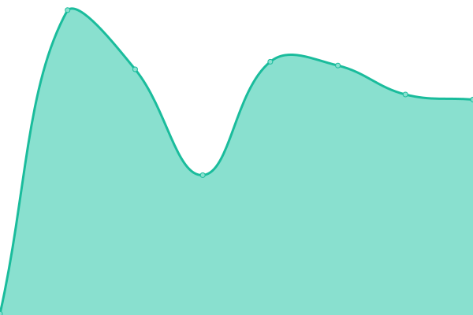

# [📈 Live Status](https://sed-infra.github.io/upptime): <!--live status--> **🟧 Partial outage**

This repository contains the open-source uptime monitor and status page for [sed-infra](https://sed-infra.github.io/upptime), powered by [Upptime](https://github.com/upptime/upptime).

With [Upptime](https://upptime.js.org), you can get your own unlimited and free uptime monitor and status page, powered entirely by a GitHub repository. We use [Issues](https://github.com/sed-infra/upptime/issues) as incident reports, [Actions](https://github.com/sed-infra/upptime/actions) as uptime monitors, and [Pages](https://sed-infra.github.io/upptime) for the status page.

<!--start: status pages-->
<!-- This summary is generated by Upptime (https://github.com/upptime/upptime) -->
<!-- Do not edit this manually, your changes will be overwritten -->
<!-- prettier-ignore -->
| URL | Status | History | Response Time | Uptime |
| --- | ------ | ------- | ------------- | ------ |
|  Infra Uplink | 🟩 Up | [infra-uplink.yml](https://github.com/sed-infra/upptime/commits/HEAD/history/infra-uplink.yml) | 

 99ms
     
 | 

<a href="https://status.cedricfarinazzo.fr/history/infra-uplink">97.81%</a>
    

|  Server - Bastion ssh | 🟩 Up | [server-bastion-ssh.yml](https://github.com/sed-infra/upptime/commits/HEAD/history/server-bastion-ssh.yml) | 

 96ms
     
 | 

<a href="https://status.cedricfarinazzo.fr/history/server-bastion-ssh">100.00%</a>
    

|  k8s - Cluster API | 🟩 Up | [k8s-cluster-api.yml](https://github.com/sed-infra/upptime/commits/HEAD/history/k8s-cluster-api.yml) | 

 96ms
     
 | 

<a href="https://status.cedricfarinazzo.fr/history/k8s-cluster-api">97.82%</a>
    

|  k8s - Argocd | 🟩 Up | [k8s-argocd.yml](https://github.com/sed-infra/upptime/commits/HEAD/history/k8s-argocd.yml) | 

 402ms
     
 | 

<a href="https://status.cedricfarinazzo.fr/history/k8s-argocd">97.82%</a>
    

|  k8s - Ops View | 🟩 Up | [k8s-ops-view.yml](https://github.com/sed-infra/upptime/commits/HEAD/history/k8s-ops-view.yml) | 

 458ms
     
 | 

<a href="https://status.cedricfarinazzo.fr/history/k8s-ops-view">97.83%</a>
    

|  k8s - WebView | 🟩 Up | [k8s-web-view.yml](https://github.com/sed-infra/upptime/commits/HEAD/history/k8s-web-view.yml) | 

 636ms
     
 | 

<a href="https://status.cedricfarinazzo.fr/history/k8s-web-view">97.83%</a>
    

|  k8s - S3 | 🟩 Up | [k8s-s3.yml](https://github.com/sed-infra/upptime/commits/HEAD/history/k8s-s3.yml) | 

 403ms
     
 | 

<a href="https://status.cedricfarinazzo.fr/history/k8s-s3">97.84%</a>
    

|  k8s - Vault | 🟩 Up | [k8s-vault.yml](https://github.com/sed-infra/upptime/commits/HEAD/history/k8s-vault.yml) | 

 445ms
     
 | 

<a href="https://status.cedricfarinazzo.fr/history/k8s-vault">97.84%</a>
    

|  k8s - Master node | 🟩 Up | [k8s-master-node.yml](https://github.com/sed-infra/upptime/commits/HEAD/history/k8s-master-node.yml) | 

 232ms
     
 | 

<a href="https://status.cedricfarinazzo.fr/history/k8s-master-node">97.85%</a>
    

|  k8s - Node 1 | 🟥 Down | [k8s-node-1.yml](https://github.com/sed-infra/upptime/commits/HEAD/history/k8s-node-1.yml) | 

 234ms
     
 | 

<a href="https://status.cedricfarinazzo.fr/history/k8s-node-1">0.00%</a>
    

|  k8s - Node 2 | 🟩 Up | [k8s-node-2.yml](https://github.com/sed-infra/upptime/commits/HEAD/history/k8s-node-2.yml) | 

 131ms
     
 | 

<a href="https://status.cedricfarinazzo.fr/history/k8s-node-2">97.86%</a>
    

|  App - Dev Site | 🟩 Up | [app-dev-site.yml](https://github.com/sed-infra/upptime/commits/HEAD/history/app-dev-site.yml) | 

 347ms
     
 | 

<a href="https://status.cedricfarinazzo.fr/history/app-dev-site">97.86%</a>
    

|  App - Portfolio | 🟩 Up | [app-portfolio.yml](https://github.com/sed-infra/upptime/commits/HEAD/history/app-portfolio.yml) | 

 467ms
     
 | 

<a href="https://status.cedricfarinazzo.fr/history/app-portfolio">97.87%</a>
    

|  App - Portfolio2 | 🟩 Up | [app-portfolio2.yml](https://github.com/sed-infra/upptime/commits/HEAD/history/app-portfolio2.yml) | 

 915ms
     
 | 

<a href="https://status.cedricfarinazzo.fr/history/app-portfolio2">97.87%</a>
    

|  App - Cloud | 🟩 Up | [app-cloud.yml](https://github.com/sed-infra/upptime/commits/HEAD/history/app-cloud.yml) | 

 1306ms
     
 | 

<a href="https://status.cedricfarinazzo.fr/history/app-cloud">97.88%</a>
    

<!--end: status pages-->

[**Visit our status website →**](https://sed-infra.github.io/upptime)

## 📄 License

- Powered by: [Upptime](https://github.com/upptime/upptime)
- Code: [MIT](./LICENSE) © [Anand Chowdhary](https://anandchowdhary.com), supported by [Pabio](https://pabio.com)
- Data in the `./history` directory: [Open Database License](https://opendatacommons.org/licenses/odbl/1-0/)
